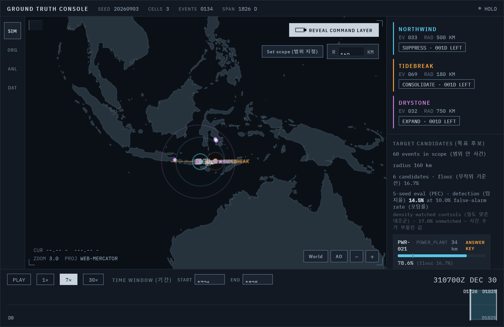

# 무엇을 모아야 예측이 되는가

테러 사건 데이터를 소재로, **"어떤 데이터를 모아야 예측이 가능해지는가"**를 측정하는 방법론 연구입니다. 예측기를 만드는 프로젝트가 아니라, **예측 가능성 자체와 그걸 좌우하는 데이터의 값어치**를 재는 도구예요.

> 북경이공대학교 빅데이터 수업에서 출발한 개인 프로젝트 · 2026

---

## 왜 이 질문인가

"AI가 테러를 예측한다"는 말은 그럴듯하지만, 실제 분석 현장에서는 가장 경계하는 과장입니다. 예측이 되는지 안 되는지를 먼저 따지지 않고 "된다"고 주장하는 것이니까요.

정작 분석가가 마주하는 진짜 질문은 이쪽입니다.

- 이 현상이 **애초에 예측 가능하긴 한가?**
- 예측하려면 **어떤 데이터를 모아야 하는가?** (위치? 시간? 대상 정보? — 무엇에 예산을 쓸 것인가)
- 아무리 좋은 모델을 써도 **넘을 수 없는 한계(천장)는 어디인가?**

이 프로젝트는 화려한 예측 대신 그 **한계를 냉정하게 재는 쪽**을 택했습니다. 그래서 결과물은 "다음 공격 예측"이 아니라, **"이 데이터로는 여기까지 예측된다, 그 이상은 어떤 데이터를 더 모아야 한다"**를 숫자로 보여주는 도구입니다.

### 무엇이 진짜이고 무엇이 가공인가

이 구분은 명확히 해둡니다.

- **실제 공개 데이터** — 지형·해안선(Natural Earth)과 후보 시설의 **위치**(OpenStreetMap, ODbL). 시설이 그 자리에 있는 이유(전력망, 항로, 인구)가 곧 분석이 성립하는 조건이라, 위치를 지어내면 방법론 시연이 아니라 게임이 됩니다. 다만 **시설 이름은 쓰지 않습니다** — 위치는 현실적이되, 어떤 화면도 실제 시설의 표적 목록으로 읽히지 않도록.
- **전부 가공** — 조직, 사건, 지휘부 명령, 작전 목표. 실존 단체를 본뜨지 않았습니다.

**이것은 허구의 방법론 시뮬레이션입니다.** 실제 테러 양상에 대해 어떤 주장도 하지 않으며, 결과는 **방법에 대한 것**이지 세계에 대한 것이 아닙니다.

---

## 핵심 아이디어 — 정답을 아는 세계를 만든다

모델이 잘 맞히는지 채점하려면 **정답을 알아야** 합니다. 그런데 진짜 데이터는 정답(왜 이 사건이 이렇게 일어났는지의 규칙)을 알려주지 않죠.

그래서 발상을 뒤집었습니다.

**규칙을 내가 직접 정한 가짜 세계를 만들고, 그 세계가 뱉은 활동 기록만 모델에게 준 뒤, 모델이 내가 심어둔 규칙을 되찾아내는지 측정한다.**

정답을 내가 알고 있으니, 이렇게 물을 수 있습니다:

- 좌표만 주면 얼마나 맞히나?
- 날짜를 더 주면 무엇이 더 잡히나?
- 대상 유형·계절을 더 주면?
- 그리고 — **아무 데이터로도 넘을 수 없는 천장은 어디인가?**

이 "천장"은 겹치는 영역의 사건처럼 **원래 구분이 불가능한 것**의 비율이에요. 정답을 알기에 계산할 수 있고, 이게 있어야 "정확도 66%"가 좋은 건지 나쁜 건지 판단이 됩니다.

---

## 첫 번째 질문 — 어떤 데이터가 어느 조직을 되찾는가

가짜 세계에 조직 셋을 서로 겹치게 배치했습니다. 셋의 활동 영역이 겹치니 **위치만으로는 구분이 안 됩니다.** 여기에 데이터를 하나씩 더해가며 무엇이 되찾아지는지를 쟀어요.

| 준 데이터 | 전체 정확도 | 무엇이 되찾아지나 |
|---|---:|---|
| 좌표만 | 64.7% | 겹쳐서 셋 다 어중간 |
| **+ 날짜** | 68.1% | **이동하는 조직**을 되찾음 (recall 72% → **87%**, +14.9%p) |
| **+ 대상·계절** | 62.4% | **계절 타는 조직**을 되찾음 (recall 47% → **63%**, +16.1%p) |

바닥(아무 정보 없이 다수결로 찍기) **38.8%**, 천장(이론상 최선) **86.6%**.

읽는 법이 중요합니다. **전체 정확도는 거의 안 움직이고, 오히려 마지막엔 내려가요.** 핵심은 전체 정확도가 아니라 **조직별로 무엇이 되찾아지는가**입니다.

- **날짜**는 위치를 옮겨 다니는 조직을 되찾습니다 — 시점을 알면 그 조직이 그때 어디쯤 있었는지가 특정되니까요.
- **대상·계절**은 계절을 타는 조직을 되찾습니다.
- 정직한 반전 하나: 대상 정보를 넣으면 대상 선호가 뚜렷한 조직은 살아나지만, **선호가 없는 조직은 오히려 손해**를 봅니다. 특성은 만능이 아니라, 그 신호를 가진 대상을 되찾는 대신 다른 걸 희생시킬 수 있어요.

이 표가 곧 **"수집 가치 분석"**입니다 — 어떤 데이터가 무엇을 되찾는지가, 곧 무엇을 모을 값어치가 있는지예요. 그리고 어떤 조합도 천장(86.6%)에는 못 미칩니다. 겹침에서 오는 **환원 불가능한 모호함**이 남기 때문이고, 그걸 아는 것이 이 도구의 요점입니다.

이 실험은 브라우저에서 바로 돌아갑니다 (지도로 세계를 보고, 분석 화면에서 위 표를 봅니다). 아래 [실행](#실행) 참고.

---

## 두 번째 질문 — 흩어진 사건들이 무엇을 노리는가

위가 "어느 조직인가"를 물었다면, 실제 분석관이 던지는 질문은 한 단계 위입니다.

**시설을 노리는 작전은 그 시설을 때리는 것으로 시작하지 않습니다.** 주변부터 건드리죠 — 접근로의 사고, 그 지역의 정전, 통신 장애. 목표 자체는 관측되는 기록에 나타나지 않습니다.

그래서 이렇게 뒤집었습니다: **흩어진 사건들만 보고, 무엇을 준비하고 있는지 역추론한다.**

### 문제를 진짜로 만드는 세 가지

- **후보 시설의 위치는 실제입니다.** 발전소가 그 자리에 있는 건 전력망과 인구 때문이고, 위치를 지어내면 알래스카 산속에 데이터센터가 생깁니다. OpenStreetMap의 실제 좌표(ODbL)를 쓰되 **이름은 뺐습니다** — 배치는 현실적이면서, 화면 한 장이 실제 시설 표적 목록으로 읽히지 않도록.
- **사건의 80%는 무관한 잡음입니다.** 모든 사건이 누군가의 작전이면 분석할 게 없어요. 그리고 **잡음도 시설 주변에 몰리게** 했습니다. 안 그러면 "시설 근처에 사건 있음 = 목표"가 되어 시시해집니다.
- **여러 조직이 동시에 각자 다른 목표를 노립니다.** 그래야 "어느 사건들이 한 묶음인가"가 진짜 문제가 됩니다.

### 심어둔 신호 세 가지

| 신호 | 내용 | 필요한 데이터 |
|---|---|---|
| **근접** | 사건이 목표 주변 고리에 떨어진다 | 좌표 |
| **포위** | 한쪽이 아니라 사방에서 둘러싼다 | 좌표 |
| **수렴** | 작전이 진행될수록 목표에 **가까워진다** | 좌표 + **날짜** |

### 결과

```
                       적중률(1순위)        바닥값   배수    탐지율(오탐 10%)
좌표만                 39.3%               13.5%   2.91배   5.0%
 + 포위                37.4%               13.5%   2.77배   6.9%
 + 수렴(날짜)          51.5%               13.5%   3.81배  14.5%
```

시드 5개, 캠페인 270건, 범위당 경쟁 후보 약 9.2개 기준입니다.



위 화면에서 도구는 `PWR-021`을 1순위 78.6%로 짚었고, 정답 공개(`ANSWER KEY`)가 그게 실제 목표임을 확인해줍니다. 정답을 끄면 화면과 코드 어디에도 정답이 남지 않습니다 — 추론이 정답을 보고 푸는 일을 구조적으로 막아둔 것입니다.

**수렴이 일하는 신호입니다.** 작전이 진행되며 사건이 목표로 좁혀 들어오는 패턴 — 이건 **날짜 없이는 보이지 않습니다.** 이 프로젝트의 논지가 여기서 측정됩니다: *이 데이터를 모아야 이 예측이 됩니다.*

### 정직하게 남기는 두 가지

**포위는 여기서 작동하지 않습니다** (−1.85%p, 오히려 약간 나쁨). 섬이 좁아 사방을 둘러쌀 수 없는 지형이라서요. 안 되는 걸 안 된다고 적는 게 억지로 되게 만드는 것보다 낫습니다.

**탐지는 어렵습니다.** 범위 안에서 목표를 1순위로 짚는 건 잘하지만(바닥값의 3.8배), **"여기서 작전이 벌어지고 있다"와 "그냥 사건 많은 동네다"를 가르는 건** 훨씬 어렵습니다. 탐지율 14.5%는 **대조군의 사건 밀도까지 맞춘** 값이고, 맞추지 않으면 17.0%로 보입니다 — 그 차이가 "사건 수만 세도 벌 수 있었던 몫"입니다.

---

## 두 단계

성격이 다른 두 단계가 한 저장소에 있습니다.

**1단계 — 수업 실습 (2026-04, 진짜 GTD 데이터)**

실제 [Global Terrorism Database](https://www.start.umd.edu/gtd/)(1970~2015, 15만여 건)로 "좌표만으로 무기 유형을 맞히기"를 해봤습니다. 여기서 **두 개의 벽**에 부딪혔고, 그게 2단계를 낳았어요.

- 정확도 **68.0%**가 나왔는데 — 다수 클래스로 전부 찍어도 **59.5%**라, 실제 기여는 약 **8.5%p**뿐. 그런데 이게 좋은 건지 나쁜 건지 판단할 **천장이 없었습니다.**
- GTD는 "일어난 사건"만 있고 "안 일어난 경우"가 없어서, **"여기서 일어날까"를 학습시킬 수가 없었습니다.**

두 벽 다 근본은 하나예요 — **정답을 모르니 채점이 안 된다.** 자세한 기록: [`docs/phase1/`](docs/phase1/).

**2단계 — 방법론 연구 (2026-09~, 정답을 아는 합성 데이터)**

1단계의 벽을 "정답을 내가 정한 세계를 만든다"로 뚫은 것이 위 [핵심 아이디어](#핵심-아이디어--정답을-아는-세계를-만든다)와 [첫 번째 질문](#첫-번째-질문--어떤-데이터가-어느-조직을-되찾는가)과 [두 번째 질문](#두-번째-질문--흩어진-사건들이-무엇을-노리는가)입니다. 지금 브라우저 앱으로 동작합니다.

| 문서·산출물 | 내용 |
|---|---|
| [`docs/phase2/PLAN.md`](docs/phase2/PLAN.md) | 왜 이 방향인지, 심어둔 신호 설계, 평가 설계 (영문) |
| [`docs/phase2/SPEC.md`](docs/phase2/SPEC.md) | 구현 명세서 — 시뮬레이션 알고리즘, 데이터 규약, 화면, 검수 기준 (영문) |
| [`docs/phase2/SPEC_M3.md`](docs/phase2/SPEC_M3.md) | 목표 추론 명세서 — 작전·잡음 생성, 추론 엔진, 평가 설계 (영문) |
| [`docs/phase2/DEVLOG.md`](docs/phase2/DEVLOG.md) | 작업 기록 — 막힌 지점과 판단 이유 (영문) |
| [`phase2/app/`](phase2/app/) | 실행되는 앱 — 지도·기간·범위 지정, 목표 후보 순위, 분석 뷰 |

---

## 실행

브라우저에서 도는 정적 앱이라 서버·API 키가 필요 없습니다. 로컬에서 띄우려면:

```bash
python -m http.server 8779 --directory phase2/app
# → http://127.0.0.1:8779
```

`.claude/launch.json`에 `app`으로 등록되어 있습니다. (`file://`로 직접 열면 자바스크립트가 안 도니 반드시 HTTP로 띄웁니다.)

---

## 파일

```
phase1/                     2026-04 수업 실습 (진짜 GTD)
├── data_preprocessing.ipynb    컬럼 선별, 탐색적 분석
├── knn.ipynb                   KNN 학습·평가, 지리적 분포 시각화
└── presentation.mp4            수업 발표 영상

phase2/                     2026-09~ 방법론 연구 (합성 데이터)
├── app/                        실행되는 앱 (지도·목표 추론·분석 뷰)
└── prototype/index.html        초기 시각 프로토타입 (참고용)

docs/
├── phase1/                     1단계 기획서·개발일지 (영문)
├── phase2/                     2단계 기획서·명세서·개발일지 (영문)
└── screenshots/                화면 기록
```

원본 GTD 데이터(`terror/globalterrorism.csv`)는 용량과 이용 약관 때문에 저장소에 넣지 않았습니다. [GTD 공식 사이트](https://www.start.umd.edu/gtd/)에서 신청해 받을 수 있습니다. 2단계의 합성 데이터는 앱을 실행하면 그 자리에서 생성됩니다.
